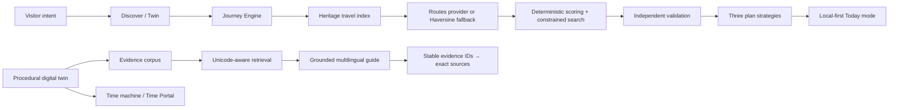

# Bharatverse AI 🇮🇳

> **See India before you go. Understand it when you arrive.**

Bharatverse is an evidence-grounded heritage intelligence and travel platform. It connects navigable procedural digital twins, historical reconstruction, a source-bound multilingual guide, and a deterministic journey optimizer so a visitor can move continuously from curiosity to a feasible real-world trip.

The product loop is:

> Discover → Preview in Digital Twin → Add to Journey → Optimize Trip → Travel → Contextual Guide → Time Portal → Heritage Passport

## Why it is different

Most trip planners know listings and routes but not the monument. Most heritage experiences stop at information or spectacle. Bharatverse joins both domains without collapsing their trust boundaries:

- Heritage claims remain attached to evidence levels and registered sources.
- Procedural twins retain spatial context, interiors, hotspots and historical phases.
- The Journey Engine enforces time, budget, distance and must-see constraints in deterministic TypeScript.
- The guide may explain a computed plan, but an LLM never chooses or validates the route.
- Operational travel facts are labelled `LIVE`, `VERIFIED`, `ESTIMATED`, `DEMO` or `UNVERIFIED`.

## Product surfaces

- `/` — tourist-first cinematic landing page and 60-second journey entry
- `/explore` — visual destination discovery with tourist filters and Add to Journey
- `/plan` — constraint-driven Journey Engine with three strategies and What-if controls
- `/trips` — device-local saved journey library
- `/today` — focused on-trip view and Budget Guardian
- `/atlas` — geographic heritage index with safe schematic fallback
- `/site/[slug]` — the existing full procedural heritage twin workspace
- `/site/[slug]/time-portal` — honest manual historical camera alignment
- `/guide` — multilingual evidence-grounded heritage guide
- `/method`, `/sources`, `/conservation`, `/about/data-policy` — stewardship and trust surfaces

## Architecture



### Heritage architecture

The immutable scholarly record lives in `lib/heritage`. Its evidence taxonomy is:

- `VERIFIED_FACT`
- `INTERPRETATION`
- `ORAL_TRADITION`
- `FOLKLORE`
- `RECONSTRUCTION`
- `AI_ASSISTED_SUMMARY`

The procedural world system under `lib/twin` and `components/twin` preserves orbit, first-person walking, interiors, portals, hotspots, cinematics, photo mode, minimap, time-driven geometry and mobile/reduced-motion behavior.

### Journey Engine

The travel domain lives in `lib/travel` and keeps rapidly changing operational data separate from heritage records.

Current deterministic flow:

1. Convert researched heritage sites into a travel interoperability index.
2. Estimate route distance from recorded WGS84 coordinates.
3. Select the fastest allowed transport estimate for each candidate.
4. Score interest fit, heritage value, twin availability, cost and transit.
5. Enforce must-see, maximum daily travel, budget and strict accessibility constraints.
6. Build intentionally different Best Overall, Save Money and Maximum Heritage strategies.
7. Validate budget, duplicates, must-see inclusion and travel limits independently.

Costs are ranges and optimization uses the conservative maximum. A 10% contingency is reserved by default.

## Stack

- Next.js 16.3 App Router
- React 19 and TypeScript
- Tailwind CSS 4 and shadcn primitives
- Three.js, React Three Fiber and Drei
- Motion
- Google Maps browser SDK with a separately restricted public key
- Vercel AI SDK and Groq for the optional live guide
- Deterministic local fallbacks for travel and guide evidence

## Setup

```bash
pnpm install
cp .env.example .env.local
pnpm dev
```

Environment variable names:

```env
GROQ_API_KEY=
GOOGLE_MAPS_SERVER_API_KEY=
NEXT_PUBLIC_GOOGLE_MAPS_BROWSER_KEY=
WEATHER_API_KEY=
```

The browser Maps key is public by design and must be restricted by domain/referrer and API in Google Cloud. Server-side Routes/Places keys must never be passed through React props or exposed with `NEXT_PUBLIC_`.

## Fallback and demo behavior

- No browser Maps key: the atlas renders the internal schematic map.
- No live routing: the Journey Engine uses Haversine distance and conservative mode assumptions, labelled `ESTIMATED`.
- No Groq key: the guide returns the closest cited evidence as a clearly labelled fallback instead of a dead spinner.
- Conservation data: always labelled `DEMO SYNTHETIC`; it is never presented as monument condition.
- Saved trips and spending: versioned local browser storage; no account is required for the SIH demo.

## Privacy and permissions

Trips, preferences and spending stay on the current device in this build. Camera permission is requested only inside Time Portal; the stream is not uploaded and stops when the experience closes. Location is not continuously tracked. See `/about/data-policy` for the complete in-product explanation.

## Validation

```bash
pnpm typecheck
pnpm test
pnpm build
```

Automated tests cover interior-level semantics, Unicode retrieval across Indic scripts, stable citation mapping, deterministic optimization, must-see inclusion, daily travel limits, conservative budget enforcement and strict accessibility behavior.

## SIH jury demo

1. Open the homepage and use the 60-second journey brief.
2. Enter a flagship twin from Explore.
3. Walk into an interior and open a documented hotspot.
4. Ask “What am I looking at and how do we know?” and inspect stable evidence citations.
5. Scrub the historical phase so geometry changes.
6. Press **Add to journey**.
7. Set origin, days, budget and interests; build the route.
8. Compare the three strategies and expand “Why is this in my itinerary?”
9. Lower the budget or travel limit in What-if and recompute.
10. Save the journey and open Today mode.
11. Add an actual expense in Budget Guardian.
12. Open Time Portal and manually align a cited historical phase.
13. Finish in Method / Sources / Conservation to show the institutional trust layer.

## Current limitations

- Route times, costs and entry allowances are estimates until server-side provider adapters are configured.
- Opening hours and accessibility are not yet populated with live/verified provider records, so the planner warns and strict accessibility excludes unknowns.
- The optimizer currently schedules one primary researched heritage experience per day; provider-discovered secondary POIs are the next expansion.
- Time Portal uses honest manual alignment, not survey-grade AR registration.
- Local storage is device-specific and has no cloud sync.
- A service-worker-based full offline package and legal provider-aware caching are not yet included.
- Heritage Passport data structures are prepared through local state, but the full journal surface is a post-hackathon milestone.

## Next startup milestone

Add a server-only Google Routes/Places adapter plus a small curated operational database for opening windows and verified accessibility. That single milestone expands route realism while preserving the current deterministic optimizer, source freshness model and graceful fallback.
